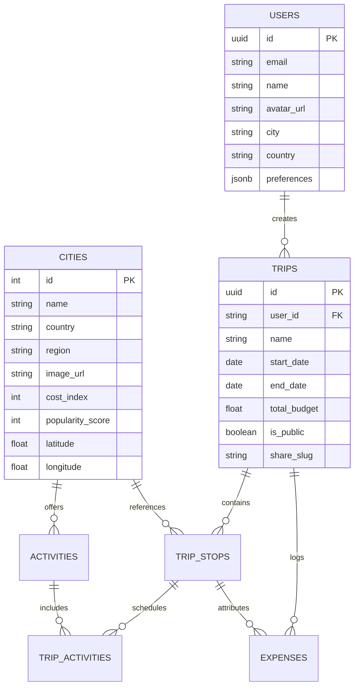

# 🌍 GlobeTrotter — Empowering Personalized Travel Planning

<div align="center">

[](https://globetrotter-travel.vercel.app)


**An intelligent, multi-city travel planning platform combining 3D spatial visualization, real-time satellite geocoding, day-by-day itinerary orchestration, and dynamic budget analytics.**

[🚀 Explore Live Demo](https://globetrotter-travel.vercel.app) • [✨ Key Features](#-key-features) • [🛠️ Tech Stack](#-modern-tech-stack) • [🗄️ Database Architecture](#-database-architecture) • [⚡ Getting Started](#-getting-started)

</div>

---

## 📖 About GlobeTrotter

Planning multi-city journeys is historically fragmented, cumbersome, and disconnected. Travelers are forced to juggle disparate spreadsheets, mapping tools, currency converters, and local guides.

**GlobeTrotter transforms the way travelers dream, design, and share adventures.**
By fusing **3D WebGL spatial exploration**, **real-time global geocoding verification**, and **collaborative itinerary authoring**, GlobeTrotter offers a seamless end-to-end ecosystem where exploring destinations is as exciting as the journey itself.

---

## ✨ Key Features

### 🌐 1. 3D Real-Time Interactive Globe
- **Fluid 360° Orbit Exploration**: Built with **Three.js** and `OrbitControls`, allowing travelers to rotate, spin, drag, and zoom around the earth with momentum.
- **Procedural HD Continents & Satellite Fallback**: Custom high-resolution procedural canvas renderer guaranteeing crisp geographical rendering offline and online.
- **Glowing Flight Arcs & Interactive Node Pins**: Pulsing gold pins highlighting top global destinations with instant city preview popups.

### 🛰️ 2. Dynamic Real-World Location Verification Engine
- **Search Any Global Destination**: Search unlisted cities or regions (e.g. *Goa, Varanasi, Kyoto, Zurich, Banff*).
- **Automated Real-World Verification**: Integrates **OpenStreetMap Nominatim** + **Wikipedia API** to verify real-world existence, fetch GPS coordinates, country, region, authentic summary, and high-res imagery.
- **Auto-Provisioned Curated Activities**: Automatically generates 4 local activities (City Tour, Culinary Tasting, Sunset Viewpoint, Adventure Excursion) in **₹ INR** upon discovery.
- **Instant Error Detection**: Clear UI feedback when a searched destination does not exist on Earth.

### 📅 3. Multi-Stop Itinerary Planner & Timeline
- **Sequential Multi-City Stop Management**: Add, rearrange, and configure arrival/departure dates and allocated budgets per stop.
- **Activity Scheduling**: Organize activities across time slots (*Morning, Afternoon, Evening, Night*) with real-time budget deductions.
- **Interactive Dual View**: Toggle between a **Step-by-Step Chronological Timeline** and a **Full Monthly Calendar View**.

### 💰 4. Smart Financial Breakdown & Budget Analytics
- **100% Indian Rupee Localization (`₹ INR`)**: Formatted with standard Indian number formatting (`en-IN`).
- **Descriptive Daily Budget Tiers**: Clear guidance replacing raw symbols:
  - *Budget (~₹1,500/day)*
  - *Affordable (~₹3,500/day)*
  - *Moderate (~₹6,500/day)*
  - *Premium (~₹12,000/day)*
  - *Luxury (~₹25,000/day)*
- **Interactive Data Visualizations**: Real-time category allocation pie charts and expense distribution powered by **Recharts**.
- **Expense Ledger**: Record, categorize (*Accommodation, Food, Transport, Activities, Shopping*), and track real-time budget surplus/deficit.

### 👥 5. Community Feed & 1-Click Itinerary Cloning
- **Public Trip Showcase**: Publish curated itineraries with custom shareable permalinks (`/share/[slug]`).
- **1-Click Forking**: Clone public community itineraries directly into your personal workspace with all stops, activities, and budget allocations preserved.

### 👤 6. Custom Profile Studio & Live Avatar Sync
- **Device Photo Upload**: Base64 file reader supporting custom device photo uploads.
- **Explorer Avatar Presets**: Pre-designed avatar gallery with live cross-tab and navbar synchronization.

### 📊 7. Admin Analytics & Destination Insights
- Real-time platform metric dashboards tracking active itineraries, trending destinations, cost index analytics, and user engagement graphs.

---

## 🛠️ Modern Tech Stack

| Layer | Technologies |
| :--- | :--- |
| **Framework** | **Next.js 16** (App Router, Turbopack, Serverless API Routes) |
| **Frontend & UI** | **React 19**, Modern Vanilla CSS Tokens, Glassmorphism, Micro-animations |
| **3D Graphics** | **Three.js**, OrbitControls, Procedural Canvas Shaders |
| **Database & Auth** | **Supabase (PostgreSQL)** + Resilient Local-First Offline Cache |
| **Geocoding & Maps** | **OpenStreetMap Nominatim API**, **Wikipedia REST API** |
| **Data Visualization** | **Recharts** (Interactive Pie, Bar & Area Charts) |
| **Icons & Typography** | **React Icons** (Feather Icons, FontAwesome 6), Google Outfit & Playfair |
| **Deployment** | **Vercel** (Global Edge CDN, Instant SSL, Auto-Deploy on Git Push) |

---

## 🗄️ Database Architecture

GlobeTrotter is built with a **PostgreSQL relational schema** configured on Supabase:



*The complete schema with full seed data is located in [`supabase_schema.sql`](./supabase_schema.sql).*

---

## 🚀 Getting Started

### 1. Clone the Repository
```bash
git clone https://github.com/Juhi2611/Odoo-LDCE.git
cd Odoo-LDCE
```

### 2. Install Dependencies
```bash
npm install
```

### 3. Configure Environment Variables (Optional for Supabase Cloud Sync)
Create a `.env.local` file in the root directory:
```env
NEXT_PUBLIC_SUPABASE_URL=https://your-project-id.supabase.co
NEXT_PUBLIC_SUPABASE_ANON_KEY=your-anon-public-key
```
*(If no keys are provided, GlobeTrotter's local-first engine automatically runs in offline resilient mode).*

### 4. Run the Development Server
```bash
npm run dev
```
Open [http://localhost:3000](http://localhost:3000) in your browser.

---

## 🌐 Live Deployment

GlobeTrotter is deployed live and globally accessible:

🔗 **Production URL**: **[https://globetrotter-travel.vercel.app](https://globetrotter-travel.vercel.app)**

### Continuous Deployment on Vercel:
1. Every commit pushed to `main` automatically triggers an optimized Next.js build.
2. Global Edge CDN routes traffic with sub-50ms latency worldwide.
3. Serverless geocoding API functions (`/api/places/search`) scale on-demand.

---

## 👥 Contributors & Hackathon Team

- **Team Members**:
  - **JUHI VANJARA**
  - **YASHVI SANGHVI**
  - **SNEHI PATEL**
  - **NANDISH PATEL**
- **Project**: GlobeTrotter — Next-Gen Travel Planning Portal
- **Hackathon**: Odoo X LDCE Virtual Hackathon 2026

---

<div align="center">
Made for global travelers.
</div>
